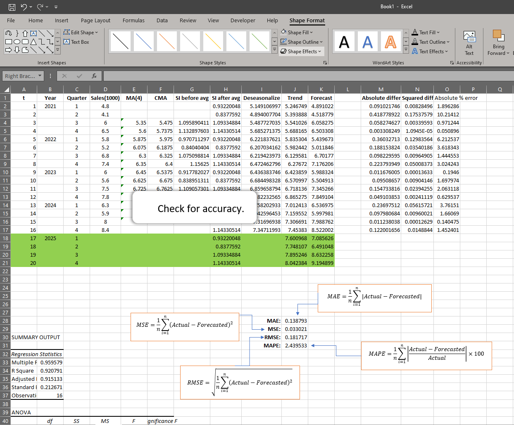

# Comparative Time Series Forecasting and Accuracy Analysis Using Excel and Python
-------

## 1. Introduction
### Objective

This project demonstrates the process of forecasting quarterly sales data for a Product in Murima SuperStores using two distinct tools; Excel and Python. It evaluates forecast accuracy through multiple metrics. The aim is to compare how each tool handles forecasting and accuracy analysis, highlighting strengths and limitations of each.

### Scope

Time series forecasting is crucial in various industries for planning and decision-making, especially in sales and supply chain management. Understanding forecast accuracy helps determine the model's reliability. This project specifically focuses on four accuracy metrics:
- Mean Absolute Error (MAE)
- Mean Squared Error (MSE)
- Root Mean Squared Error (RMSE)
- Mean Absolute Percentage Error (MAPE)
  
---
## 2. Data Description
### Dataset Overview
The dataset consists of historical quarterly Product sales from 2021 to 2024.
### Key Variables
- Quarter: Indicates each quarter of the year.
- Sales: Sales figures for each quarter.
---
## 3. Forecasting Approach
### Purpose

The primary goal is to create a model that captures trends and seasonality within the data to forecast future sales values. 

---
## 4. Excel Implementation
### Step-by-Step Process
#### a). Moving Average (MA):
- Calculated using a 4-quarter moving average. This smooths out short-term fluctuations.

#### b). Centered Moving Average (CMA):
- CMA is obtained by averaging pairs of MA values. It adjusts for timing differences, providing a baseline that balances the data around seasonal fluctuations.

    
#### c). Seasonal Indices (SI):
- Seasonal indices are calculated by dividing actual sales by CMA values for each quarter and averaging these ratios by quarter across multiple years.

    
#### d). Deseasonalize Sales:
- The sales data is divided by corresponding seasonal indices, removing the seasonal pattern and isolating the trend.

#### e). Add a time variable

#### f). Trend Analysis:

- Linear regression is used to find a trend equation for the deseasonalized sales data. The model is fitted as
  
$$ y = \beta_0 + \beta_1 x $$

where: 
- y is the dependent variable.
  
- $\beta_0$ is the intercept.
  
- $\beta_1$  is the slope(coefficient) of the independent variable x.
  
Here, quadratic terms are avoided to maintain simplicity.

    
#### g). Forecast Calculation:

- Using the trend equation, we project future sales. These forecasted values are adjusted back by the seasonal indices for each quarter to account for seasonality.

#### h). Visuals and Observations

In Excel, line chart is created to compare actual vs. forecasted sales and display the trend line derived from the deseasonalized data.

---
## 5. Python Implementation
### Steps in Python

[Python code](https://github.com/RaphaelItotia/Comparative-Time-Series-Forecasting/blob/main/assets/Product_sales.ipynb)

---
## 6. Accuracy Metrics Calculation
### Purpose

Accuracy metrics allow us to quantify how closely the forecasted values match the actual data, providing a reliable way to evaluate model performance.

### Accuracy Metrics:
- **MAE (Mean Absolute Error)**: Measures average error in units.
  
$$ \text{MAE} = \frac{1}{n} \sum_{i=1}^n |Actual-Forecasted| $$
- **MSE (Mean Squared Error)**: Measures average squared error, emphasizing larger errors.
- 
$$ \text{MSE} = \frac{1}{n} \sum_{i=1}^n (Actual-Forecasted)^2 $$
- **RMSE (Root Mean Squared Error)**: The square root of MSE, on the same scale as actual data.
- 
$$ \text{RMSE} = \sqrt{\frac{1}{n} \sum_{i=1}^n (Actual-Forecasted)^2} $$
- **MAPE (Mean Absolute Percentage Error)**: Measures error as a percentage, useful for comparing different datasets.
- 
$$ \text{MAPE} = \frac{1}{n} \sum_{i=1}^n \left| \frac{Actual-Forecasted}{Actual}\right| \times 100 $$

I used both Excel and Python to calculate these metrics, providing side-by-side comparisons.

---
## 7. Results Comparison
### Excel vs. Python Accuracy Results

|Metric	| Excel Value	| Python Value|
|-----|------|------|
|MAE	|0.138792736	|0.13879273641557638|
|MSE	|0.033021097	|0.03302109709058803|
|RMSE	|0.18171708	|0.1817170797987576|
|MAPE	|2.439532841%	|2.4395328407222077%|

#### Discussion

The results between Excel and Python closely match, indicating both tools effectively handle the data. Minor differences may be attributed to rounding. Excel is advantageous for simplicity and accessibility, while Python provides scalability and automation for larger datasets.

---
## 8. Conclusion
### Key Findings
This project demonstrates how Excel and Python can be used to forecast time series data and assess accuracy. Both tools are effective in capturing trends and seasonal effects, but Python offers more flexibility for advanced analysis and automation.
Tool Recommendations
- Excel: Suitable for small datasets and quick, hands-on analysis.
- Python: Ideal for handling large datasets, performing repetitive tasks, and producing reproducible code.
